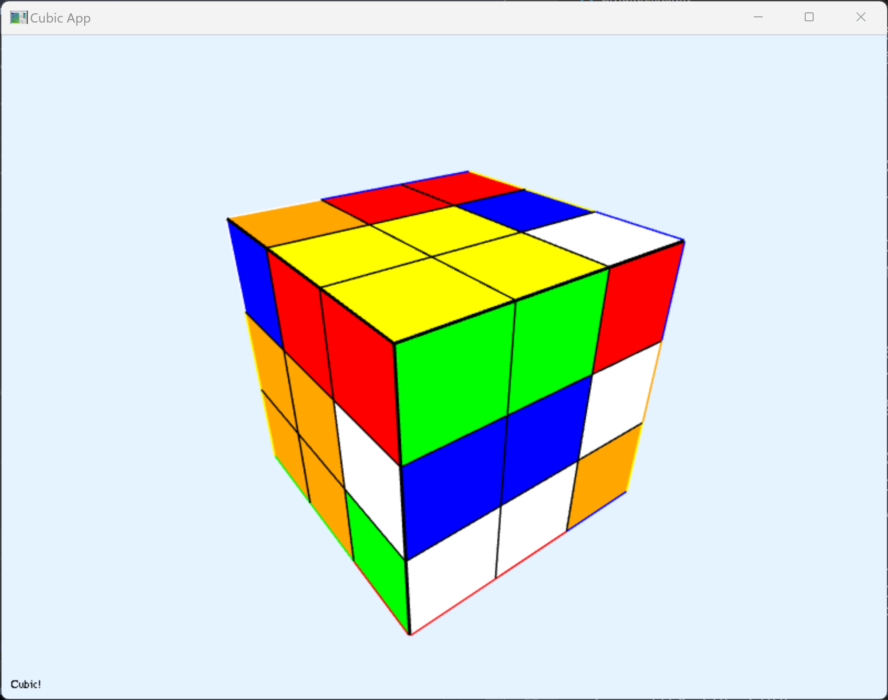

# CubeSolver

## Project description

CubeSolver is a Rubik's cube solver written in pure C++ with OpenGL 3d visualization.

## Installation guide

There are various ways how the user can get the executable binary for the project:
- One of the ways to get a binary is to build the project from sources
- The second option is to check the page with the latest [releases](https://github.com/mikhirurg/CubeSolver/releases/latest)

## How to use the project

CubeSolver application contains two main display modes: console and OpenGL visualization.
After running the application the user can interact with the CubeSolver in console mode.
There are a few commands available:
| Command | Description |
|---------|-------------|
| `print` | Print the current configuration of the cube. |
| `mix` | Shuffle the cube. |
| `user_assembly` | Turn on the user mode to allow the user to assembly the Rubik's Cube. | 
| `comp_assembly` | Perform the automatic Rubick's Cube solving. |
| `change_print` | Turn on/off the console logging about the cube configuration changes. |
| `save` | Save the Rubik's cube configuration to the file. |
| `load` | Load the Rubik's cube configuration from the file. | 
| `gl_mode` | Switch to the 3D visualisation mode. |
| `help` | Print the "help" information about the commands |
| `exit` | Exit the application |

### More information about the 3D visualization mode


The 3D visualization mode is displaying the Rubik's cube configuration in the OpenGL window. The visualization mode supports several key bindings which can allow the user to interact with the Rubik's cube:

| Key binding | Description |
|-------------|-------------|
| `u`         | Rotates the upper face left at 90 deg |
| `shift` + `u` |  Rotates the upper face right at 90 deg |
| `d` | Rotates the down face right at 90 deg |
| `shift` + `d` | Rotates the down face left at 90 deg |
| `r` | Rotates the right face up at 90 deg |
| `shift` + `r` | Rotates the right face down at 90 deg |
| `l` | Rotates the left face down at 90 deg |
| `shift` + `l` | Rotates the left face up at 90 deg |
| `f` | Rotates the front face right at 90 deg |
| `shift` + `f` | Rotates the front face left at 90 deg |
| `b` | Rotates the back face left at 90 deg |
| `shift` + `b` | Rotates the back face right at 90 deg |
| `s` | Apply the Rubik's cube solving algorithm |
| `z` | Shuffle the Rubik's cube |
| `q` | Exit the GL mode |

### Example of Rubik's cube solving:

```
Hurray! We solved this cube!!!
Number of moves: 362
Win combination: [ R R R R R R D D D F F F F F F F U U U R U L L D D R R B B B L L L D D D R R R D D D R D R R R D D D R D R R R D D D R D R R R D D D R D R R R D D D R D L L L D D D L D L L L D D D L D L L L D D D L D D D D F F F D D D F D F F F D D D F D F F F D D D F D R R M M L L L L L L U U R U U U R R R U U U F F F U F U U B U U U B B B U U U R R R U R U U U U U B B B U B U L U U U L L L U U U U U F U U U F F F U U U L L L U L F R U R R R U U U F F F U U B U B B B U B U U B B B U U U U R R R U L U U U R U L L L U R R R D D D R D R R R D D D R D R R R D D D R D R R R D D D R D U R R R D D D R D R R R D D D R D R R R D D D R D R R R D D D R D U R R R D D D R D R R R D D D R D R R R D D D R D R R R D D D R D U R R M M L L L L L L]
```

| Initial state| Assembly  | Done  |
|----|----|----|
| | &#8594; ||

## Contributing

Pull requests are welcome. For major changes, please open an issue first
to discuss what you would like to change.

## License

[MIT](/LICENSE.txt)
